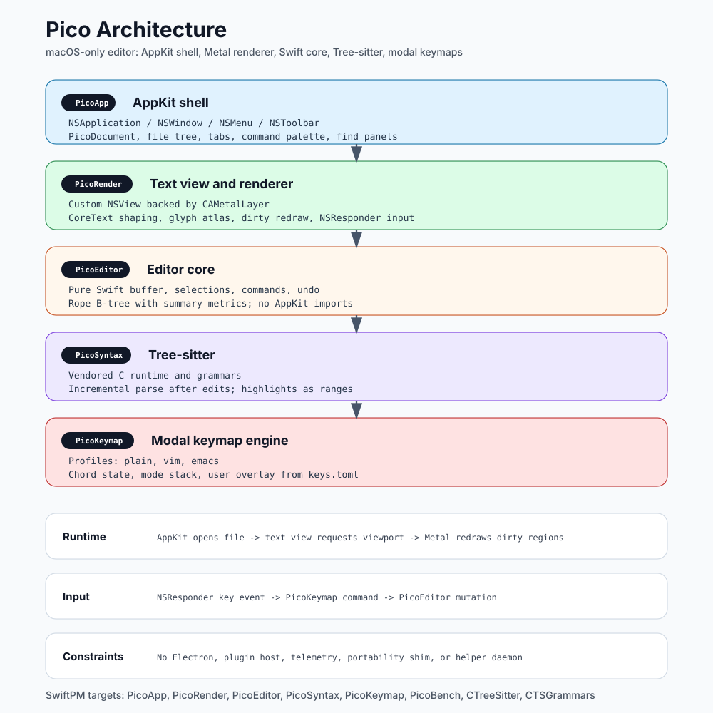

# NORTHSTAR

Codename: `pico`. Final name TBD.

## Mission
A macOS-native code editor that **opens instantly, edits anything, stays out of the way**. Sub-150 ms cold start, sub-30 MB idle RAM, modal-editing-native, OSS.

## Why this exists
- VSCode is 3.5 GB RAM + ~1.3 s cold (Electron tax).
- Zed (Rust+GPUI) ships at ~200 MB RAM, ~600 ms cold — fast but heavy; cross-platform; collab/AI-bloated.
- Sublime owns the "small+fast" tier commercially; no OSS equivalent.
- CodeEdit/CotEditor are Swift+native but plain-text-class, not modal-editing-class.
- Gap: **OSS, Swift-native, modal-first, sub-Sublime-class footprint**.

## Core principles
1. **macOS-only is a feature.** No Electron, no portability shims, no abstractions over native APIs. AppKit + Metal direct.
2. **Cold start is the headline KPI.** Every dep, every framework link, every static initializer is a budget item. <150 ms cold or it doesn't ship.
3. **Modal editing is built-in, not a plugin.** Plain, vim, and emacs profiles ship in v0.1. Keymap engine is core, not a layer.
4. **Open anything.** 1 GB log file must scroll at 60 fps. Rope buffer + Metal renderer. No file-size limits.
5. **Boring on purpose.** No AI, no collab, no terminal, no marketplace, no telemetry. Forever.
6. **One binary, no daemons.** No language servers, no extension hosts, no helper processes in v0.x.
7. **Reads as a single codebase.** A new contributor should grok the whole tree in a day. <15 kLOC target through v1.0.

## Scope — IN (v0.1 → v1.0)
- Rope-backed text buffer (Swift native impl)
- Metal-backed custom NSView text renderer w/ CoreText shaping + bitmap glyph atlas
- Tree-sitter syntax highlighting (JS/TS, JSON, HTML, CSS, Python, Rust, Go, C, C++, Markdown, YAML, TOML), grammars lazy-loaded on first file of that language
- Tabs, file tree, find/replace (regex), command palette (Cmd-Shift-P)
- Multi-cursor + column select
- Split panes (horizontal / vertical, arbitrary depth)
- Keymap engine + 3 profiles: plain (macOS-standard), vim (normal/insert/visual/operator-pending), emacs (chord-based)
- Custom keybind config (`~/.config/pico/keys.toml`)
- Undo/redo (rope snapshots + per-edit deltas)
- Native macOS integration: Services menu, Quick Look, Versions/AutoSave, Handoff, dark mode, Retina
- Notarized .dmg distribution + Homebrew cask

## Scope — OUT (v0.x, possibly forever)
- LSP / code completion / hover / diagnostics
- Integrated terminal
- Debugger / DAP
- Extension marketplace, plugin runtime
- AI assistance
- Collaboration / multiplayer
- Git UI (use the terminal)
- Linux/Windows ports
- iOS/iPadOS
- Telemetry (none, ever)

## KPI table

| KPI | Target | Stretch | Notes |
|---|---|---|---|
| Cold start (click → editable) | <150 ms | <100 ms | M-series, sudo purge between runs, Hyperfine 20 runs |
| Idle RAM (1 small file open) | <30 MB | <20 MB | RSS via `ps -o rss=` |
| RAM w/ 100k-line .ts file | <80 MB | <50 MB | Includes tree-sitter parser arena |
| 1 GB file open | <500 ms | <300 ms | First page visible, full parse async |
| Scroll FPS on 10M-line file | 60 fps | 120 fps (ProMotion) | sustained, vsync-locked |
| Keystroke → glyph | <8 ms | <5 ms | Measured via Quartz Display Link timestamp |
| Binary size (.app uncompressed) | <15 MB | <8 MB | Including all grammars |
| Total LOC (Swift+C grammars excl.) | <15 kLOC | <10 kLOC | `tokei` count |

## Benchmark protocol (frozen)
- **Hardware:** M2 or newer, 16 GB+ RAM, on AC, no other GUI apps open.
- **Tooling:** `hyperfine --warmup 0 --runs 20 --prepare 'sudo purge'` per cmd.
- **Cold-start measurement:** Each editor under test gets a `--bench-exit-on-ready` shim:
  - For `pico`: native flag — print timestamp on `applicationDidFinishLaunching` + first paint, then `NSApp.terminate`.
  - For Zed/Sublime/VSCode/CodeEdit: external observer (Swift CLI using Accessibility API `AXObserver` to detect first window-visible event), records timestamp, then `kill -TERM`.
- **Corpus** (checked into `bench/corpus/`):
  - `small.ts` (1 kLOC)
  - `large.ts` (100 kLOC)
  - `huge.log` (1 GB synthetic, gitignored — generated via script)
  - `cold.empty` (no file)
- **Competitors:** Zed (latest stable), Sublime Text 4 (latest), VSCode (latest), CodeEdit (latest release), system `TextEdit` (control).
- **Outputs:** JSON via `--export-json`, rendered to `bench/results/YYYY-MM-DD.md` and committed.
- **Regression gate:** PR CI runs the harness against `pico` only; fails if any KPI regresses >5% vs `main` baseline.

## Architecture (frozen at this level)



```
┌────────────────────────────────────────────────────────┐
│ AppKit shell                                           │
│  NSApplication · NSWindow · NSMenu · NSToolbar         │
│  Document model: NSDocument subclass (PicoDocument)    │
├────────────────────────────────────────────────────────┤
│ TextView (custom NSView, Metal-backed via CAMetalLayer)│
│  - CoreText shaping (CTLine, CTRun)                    │
│  - Bitmap glyph atlas, 1 page per (font, size, weight) │
│  - Render loop: CADisplayLink, dirty-region driven     │
│  - Input: NSResponder → KeymapEngine → EditorCommands  │
├────────────────────────────────────────────────────────┤
│ Editor core (pure Swift, no AppKit imports)            │
│  - Buffer: rope (B-tree of text chunks, summary metrics)│
│  - Selections: array of (anchor, head) ranges          │
│  - Undo: rope snapshots + delta log                    │
│  - Highlights: tree-sitter spans → ranges → style ids  │
├────────────────────────────────────────────────────────┤
│ Tree-sitter (vendored C lib via SwiftPM C target)      │
│  - Grammars lazy-loaded from app bundle on first use   │
│  - Incremental reparse on edit (TSInputEdit)           │
├────────────────────────────────────────────────────────┤
│ Keymap engine (pure Swift)                             │
│  - State: mode stack, pending chord prefix             │
│  - Profiles: plain / vim / emacs (TOML-defined)        │
│  - User overlay: ~/.config/pico/keys.toml              │
└────────────────────────────────────────────────────────┘
```

Modules (SwiftPM targets):
- `PicoApp` — AppKit shell, entry point
- `PicoRender` — Metal renderer, glyph atlas
- `PicoEditor` — buffer, selections, commands, undo
- `PicoSyntax` — tree-sitter wrapper, grammar loader
- `PicoKeymap` — modal engine, profile loader
- `PicoBench` — harness binary (separate executable)
- `CTreeSitter` — C target, vendored tree-sitter runtime
- `CTSGrammars` — C target, vendored grammars (one source group per lang, conditionally compiled)

## Risks (ranked)
1. **Metal text renderer is the unknown.** Equivalent in scope to building GPUI's text layer from scratch. Spike early. If can't hit <8 ms keystroke latency in spike, reconsider falling back to `NSTextView` (loses some KPIs but ships).
2. **Cold start <150 ms with 11 grammars bundled.** Mitigation: grammars in separate dylibs `dlopen`'d on first file of that language; nothing language-specific in launch path.
3. **Vim semantics are deep.** Ship "vim-lite" first (motions, operators, registers, basic ex). Defer macros, marks beyond `'`, `:s` regex flavor, plugins.
4. **Rope correctness under multi-cursor + UTF-8 + grapheme clusters.** Property-test heavily. Reuse Xi's rope_science test vectors.
5. **Two-person-decade scope.** Mitigation: ruthless OUT list above; cut anything that doesn't move a KPI.

## Non-goals (durable)
- Plugin ecosystem. Pico is what ships; extension would betray the cold-start KPI.
- Configurability beyond keys + theme + tab width. Pico is opinionated.
- Web. Pico does not render HTML preview, not even for Markdown.
- Sync. No cloud, no settings sync, no telemetry pings.

## Definition of done (v1.0)
- All KPIs met or stretch met for ≥3 of 8.
- Bench results published per release in `bench/results/`.
- Notarized + Sparkle-updatable .dmg on GitHub Releases.
- Homebrew cask in `homebrew-cask`.
- README shows the bench table with `pico` winning ≥4 KPIs vs Zed/Sublime/VSCode head-to-head.
