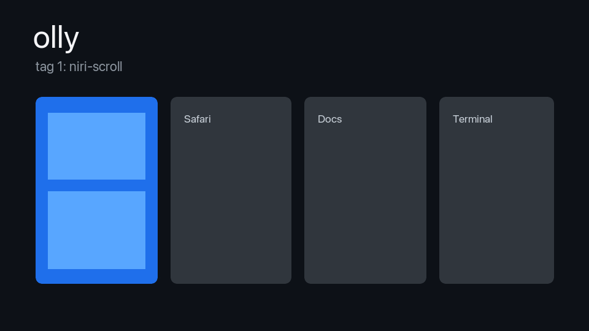

# Olly



> Status: pre-alpha. The package builds and tests, but v0.1 is not released yet.

Olly is a pure-Swift macOS window manager built around hot-swappable layout engines. The target
v0.1 shape is AX-only, tag-based, and scriptable through `ollyctl`, with first-party ecosystem
hooks for SketchyBar, JankyBorders, Übersicht, Raycast, Alfred, and external hotkey daemons.

## Why Olly

- One binary, multiple layout models: Floating, MasterStack, Manual, BSP, NiriScroll,
  Monocle, Spiral, Grid, ThreeCol, and Accordion.
- Per-tag engine binding: use scrolling columns for web, BSP for code, floating for calls.
- Swift DSL config: type-checked rules, keybinds, safe zones, and cooperative app handling.
- IPC-first automation: Unix socket plus `ollyctl` JSON commands/events.
- Ecosystem posture: yield screen real estate, emit events, do not compete with bars, launchers,
  border tools, notch apps, hotkey daemons, or capture tools.

## Install

Current source build:

```sh
./scripts/bootstrap-dev.sh
swift build -c release
swift test
.build/release/ollyApp
```

Planned v0.1 release paths:

```sh
brew install --cask olly
```

or download `Olly.dmg` from the GitHub release, open it, and drag `Olly.app` to `/Applications`.
No v0.1 cask or DMG is present in this repo yet.

## 60-Second Config

Create `~/.config/olly/Config.swift`:

```swift
import CoreGraphics
import ollyCore
import ollyDSL

public func ollyConfig() -> Config {
    Config {
        Workspaces {
            Tag.named("code")
            Tag.named("web")
            Tag.named("chat")
        }

        Engines {
            EngineDeclaration.bsp
            EngineDeclaration.niriScroll
            EngineDeclaration.masterStack
            Monocle()
            Spiral()
            Grid(.squareish)
            ThreeCol(masterRatio: 0.5)
            Accordion()
            EngineDeclaration.floating
        }

        SafeZones {
            notchPadding(16)
            reserve(rect: CGRect(x: 0, y: 900, width: 1512, height: 82), on: 1)
        }

        Keybinds {
            Keybind(KeyChord([.command, .option], .one), do: .switchTag(0))
            Keybind(KeyChord([.command, .option], .two), do: .switchTag(1))
            Keybind(KeyChord([.command, .option], .space), do: .cycleEngine)
            Keybind(KeyChord([.option], .j), do: .focus(.down))
            Keybind(KeyChord([.option], .k), do: .focus(.up))
        }

        Rules {
            Rule(match: RuleMatch(bundleID: "com.apple.dt.Xcode"), apply: RuleApply(tags: tag(0), engine: "bsp"))
            Rule(match: RuleMatch(bundleID: "com.apple.Safari"), apply: RuleApply(tags: tag(1), engine: "niri-scroll"))
            Rule(match: RuleMatch(subrole: "AXDialog"), apply: RuleApply(engine: "floating", floating: true))
        }
    }
}
```

Reload after edits:

```sh
ollyctl reload
ollyctl state --json
```

## Comparison

| Built-in layout | Model |
|---|---|
| Floating | Pass-through frames for untiled windows and dialogs. |
| MasterStack | Tall-style master pane plus stacked siblings. |
| Manual | User-shaped split tree. |
| BSP | Binary-space-partition tree. |
| NiriScroll | Horizontal scrolling column strip. |
| Monocle | Focused window fullscreen, siblings hidden offscreen. |
| Spiral | Recursive golden-ratio split of the remaining rect. |
| Grid | Square-ish or fixed row/column auto-pack. |
| ThreeCol | Centered master with balanced side stacks. |
| Accordion | Focused window expanded, siblings collapsed to strips. |

| Project | Core model | Olly difference |
|---|---|---|
| [Nehir](https://github.com/apphane-dev/nehir) | macOS tiling WM with IPC/live-config precedent. | Olly makes layout engines the central plugin primitive and ships multiple built-ins. |
| [Hiro / OmniWM](https://github.com/BarutSRB/OmniWM) | Niri/Hyprland-inspired macOS WM with signed distribution focus. | Olly keeps a Swift DSL plus stable engine contract as the main extension point. |
| [Paneru](https://github.com/karinushka/paneru) | Sliding infinite-strip macOS WM. | Olly includes a Niri-style engine but lets each tag use a different layout model. |
| [Miri](https://github.com/maria-rcks/miri) | Niri-like keyboard-first macOS WM over AX. | Olly targets hot-swappable layouts, IPC integrations, and cooperative app defaults. |
| [AeroSpace](https://github.com/nikitabobko/AeroSpace) | i3-inspired tree tiling with virtual workspace emulation. | Olly uses River-style tags and per-tag engine binding instead of one tiling paradigm. |
| [yabai](https://github.com/asmvik/yabai) | Mature macOS WM utility with BSP, CLI, and deep automation surface. | Olly v0.x stays AX-only and treats SIP-off/private APIs as out of scope. |

## Ecosystem

- Menu/status bars: `extensions/sketchybar/`, `extensions/ubersicht/`.
- Launchers: `extensions/alfred/`, `extensions/raycast/`.
- Borders: `extensions/jankyborders/`.
- Hotkey daemons: see `docs/hotkey-delegation.md`.
- Cooperative apps allowlist: `docs/cooperative-apps.yml`.
- DSL cookbook: `docs/dsl-cookbook.md`.
- Full integration matrix: `docs/menubar-notch-integration.md`.

## Development

```sh
./scripts/bootstrap-dev.sh
swiftlint lint --config .swiftlint.yml --strict
./scripts/check-no-private-api.sh
swift build -c release
swift test
```

Products:

- `ollyApp`: menubar app target.
- `ollyctl`: CLI client.
- `ollyKit`, `ollyCore`, `ollyLayouts`, `ollyDSL`, `ollyIPC`: library targets.

## Inspiration Credits

Per `NORTHSTAR.md` §3, Olly studies and credits:

- [niri](https://github.com/niri-wm/niri): scrollable tiling model.
- [macniri](https://github.com/J-x-Z/macniri): cautionary macOS port reference.
- [river](https://github.com/riverwm/river): external layout generator architecture.
- [AeroSpace](https://github.com/nikitabobko/AeroSpace): virtual workspace emulation on macOS.
- [Hiro / OmniWM](https://github.com/BarutSRB/OmniWM): macOS multi-layout precedent.
- [Nehir](https://github.com/apphane-dev/nehir): IPC, live config, command palette bar.
- [Paneru](https://github.com/karinushka/paneru): Lua scripting and sliding layout precedent.
- [Hammerspoon](https://github.com/Hammerspoon/hammerspoon): macOS extension ecosystem reference.
- [Swindler](https://github.com/tmandry/Swindler): Swift AX abstraction reference.

## Name

The name references Olruggio from *Witch Hat Atelier*, where window-ways are common.
