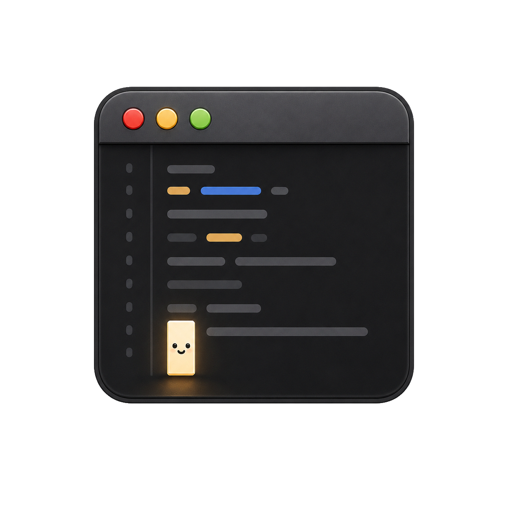

# Itsy

<div align="center">
    
</div>

macOS-native code editor targeting instant launch, low RSS, and modal editing.

[](#)


## Status

Pre-release. Do not ship the current release candidate.

- Current cold start misses the `<150 ms` target.
- Full Zed/Sublime/VSCode/CodeEdit comparison is not locally available.
- Distribution signing and notarization are blocked until a Developer ID Application certificate is installed.

Remaining work is tracked in [GitHub issues](https://github.com/gongahkia/itsy/issues).

## Config

Itsy reads user settings from `~/.config/itsy/settings.json`; see [docs/settings.md](docs/settings.md).
Generated keymap docs live at [docs/keymap-reference.md](docs/keymap-reference.md).

## Build

```sh
scripts/bootstrap.sh
swift build -c release
bench/scripts/make_app.sh
open Itsy.app
```

## Install

Local unsigned app build:

```sh
scripts/bootstrap.sh
swift build -c release
bench/scripts/make_app.sh
cp -R Itsy.app /Applications/Itsy.app
```

Release DMG install, after the signed/notarized release flow is complete:

```sh
scripts/release_doctor.sh
open Itsy-0.1.0.dmg
```

Release readiness and blocked external prerequisites are tracked in [docs/release.md](docs/release.md).

Homebrew cask install, after a cask is published:

```sh
brew install --cask itsy
```

Draft the cask locally with `scripts/make_homebrew_cask.sh` after building the release DMG.

## Bench

Latest committed release-candidate result: [bench/results/release-candidate.md](bench/results/release-candidate.md).
No benchmark was rerun for this docs-only scope update.

Environment: Apple M3, macOS 26.5.1 25F80, AC power, 20 runs, no `sudo purge`.

| App | Version/source | Runs | Mean startup ms | Min startup ms | Max startup ms | Mean RSS KB | Status |
|---|---|---:|---:|---:|---:|---:|---|
| Itsy | local `Itsy.app`, current editor/LSP/Git/tasks scope | 20 | 272.661 | 237.908 | 326.350 | 86467 | current release candidate; misses `<150 ms` target |
| Zed | 1.8.2, committed baseline | 20 | 470.856 | 330.977 | 679.386 | 182062 | historical same-version baseline; current rerun blocked by running Zed session |
| Sublime Text | not installed locally | - | - | - | - | - | not measured |
| VSCode | not installed locally | - | - | - | - | - | not measured |
| CodeEdit | not installed locally | - | - | - | - | - | not measured |

Against the committed same-version Zed baseline, Itsy is `42.1%` faster on mean startup and uses `52.5%` less RSS at first-window measurement. Current Zed comparison cannot be verified without closing the user's running Zed session.

## Feature Matrix

Itsy is intentionally narrow:

| Area | Current scope | Not in current release |
|---|---|---|
| Native editor | AppKit shell, Metal text view, Swift rope buffer, split panes, tabs, file tree, lazy PTY terminal | No Electron, collaboration, or telemetry |
| Keymaps/search | Plain/vim/emacs profiles, project find, multi-cursor, outline/goto-symbol bindings | Named Vim marks deferred |
| Syntax/themes/settings | Tree-sitter parsing/highlighting for bundled grammars, local theme files, and `settings.json` editor/theme/terminal prefs | Additional grammars/themes are incremental |
| LSP | Lazy external server sessions, document sync, diagnostics gutter, completion/resolve, hover, references panel, signature help, workspace edits/config, smoke/bench coverage | Full LSP surface is incomplete |
| DAP | Debug launch/control, Call Stack, Variables, Watches, and Debug Console in the Debugger sidebar/window | Adapter-specific debugging coverage remains incremental |
| Git UI | Status panel, unified/side-by-side diff, hunk stage/unstage, commit composer/history/drafts, branch popover, stash-on-switch, fetch/pull/push streaming | Line staging, conflict viewer, gutter hunk indicators, stash panel |
| Tasks/extensions | Built-in task discovery/run panel; extension manifests contribute tasks only | No executable plugin runtime or marketplace |
| Workspace/problems | Gitignore-aware file/symbol index, workspace/file symbols, problems panel fed by task/compiler diagnostics | GitHub issues track follow-up slices |
| Docs/QA | Generated keymap reference, screenshot capture script, changelog, coverage gate, Vim binding regression suite | Screenshot capture requires local GUI permissions |
| Distribution | Local unsigned app, DMG workflow, signed Sparkle appcast/release-note workflow | Developer ID signing/notarization credentials, first published release, Homebrew cask, final name/domain |

## Formatting

Swift source uses SwiftFormat with `.swiftformat`:

```sh
swiftformat --lint .
```
