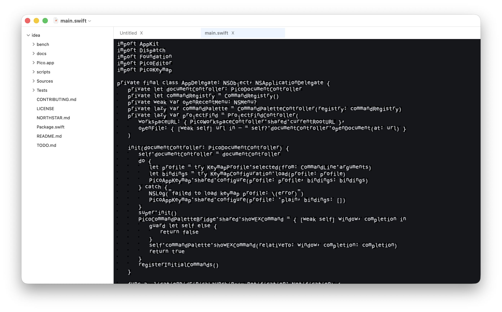

# Itsy

macOS-native code editor targeting instant launch, low RSS, and modal editing.

[](#)



## Status

Pre-release. Do not ship the current release candidate.

- Current cold start misses the `<150 ms` target.
- Full Zed/Sublime/VSCode/CodeEdit comparison is not locally available.
- Distribution signing and notarization are blocked until a Developer ID Application certificate is installed.

See [NORTHSTAR.md](NORTHSTAR.md) for scope, KPIs, architecture, and non-goals.
See [TODO.md](TODO.md) for remaining work.

## Build

```sh
swift build -c release
bench/scripts/make_app.sh
open Itsy.app
```

## Install

Local unsigned app build:

```sh
swift build -c release
bench/scripts/make_app.sh
cp -R Itsy.app /Applications/Itsy.app
```

Release DMG install, after id:301-id:303 are complete:

```sh
open Itsy-0.1.0.dmg
```

Homebrew cask install, after a cask is published:

```sh
brew install --cask itsy
```

## Bench

Latest committed release-candidate result: [bench/results/release-candidate.md](bench/results/release-candidate.md).

Environment: Apple M3, macOS 26.5.1 25F80, AC power, 20 runs, no `sudo purge`.

| App | Version/source | Runs | Mean startup ms | Min startup ms | Max startup ms | Mean RSS KB | Status |
|---|---|---:|---:|---:|---:|---:|---|
| Itsy | local `Itsy.app` | 20 | 272.661 | 237.908 | 326.350 | 86467 | misses `<150 ms` target |
| Zed | 1.8.2, committed baseline | 20 | 470.856 | 330.977 | 679.386 | 182062 | stale baseline; current rerun blocked by running Zed session |
| Sublime Text | not installed locally | - | - | - | - | - | not measured |
| VSCode | not installed locally | - | - | - | - | - | not measured |
| CodeEdit | not installed locally | - | - | - | - | - | not measured |

Against the committed same-version Zed baseline, Itsy is `42.1%` faster on mean startup and uses `52.5%` less RSS at first-window measurement. Current Zed superiority cannot be verified without closing the user's running Zed session.

## Scope

Itsy is intentionally narrow:

- AppKit shell, Metal text view, Swift rope buffer.
- Built-in plain/vim/emacs keymap profiles.
- Tree-sitter syntax highlighting for common code formats.
- LSP protocol core is in progress; no integrated LSP UI yet.
- Git status/diff core and a minimal changes panel are in progress.
- Task discovery/run core is in progress; no integrated task UI yet.
- No Electron, terminal, plugin runtime, collaboration, or telemetry.

## Formatting

Swift source uses SwiftFormat with `.swiftformat`:

```sh
swiftformat --lint .
```
