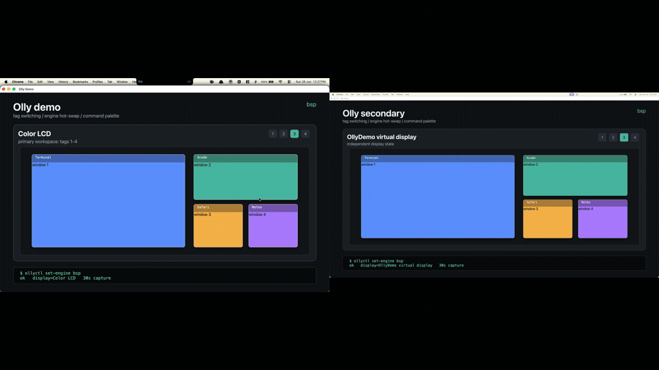

# Olly



> Status: pre-alpha. `main` builds and tests, but v0.1.0 is not released yet.
> The final release is gated on signed/notarized distribution assets and a runtime
> smoke test for the app IPC service.

Olly is a pure-Swift macOS window manager experiment built around hot-swappable
layout engines, River-style tags, and a Swift DSL config. The v0.x constraint is
strict: Accessibility APIs only, no SIP-off requirement, and no private windowing
APIs.

## Why Olly

- One package, many layout models: floating, BSP, Niri-style scrolling columns,
  master-stack, manual split trees, monocle, grid, spiral, tabbed, stacked, and
  more.
- Per-tag engine binding: use BSP for code, scrolling columns for browsers,
  floating for calls, and a different layout again on another display.
- Swift DSL config: typed tags, rules, keybinds, safe zones, animations, hooks,
  and cooperative app behavior.
- IPC-first design: newline-delimited JSON over a Unix-domain socket, with
  `ollyctl` and first-party extension examples.
- Ecosystem posture: yield screen real estate and emit events instead of
  competing with menu bars, launchers, borders, notch utilities, hotkey daemons,
  and capture tools.

## Current Shape

| Area | State |
|---|---|
| AX/window layer | Permission checks, display discovery, window snapshots, movement, wake handling, and AX tests. |
| Workspace model | River-style tag bitsets, per-display active tags, MRU history, persistence, and dispatch tests. |
| Layout engines | Shared `LayoutEngine` protocol, registry, placement diffing, and built-in engines. |
| DSL | Result-builder config, rules, keybinds, safe zones, migrations, examples, and diagnostics. |
| IPC | Protocol schema, Unix socket client/server library, event envelopes, and `ollyctl`. |
| App shell | Menu bar item, AX onboarding, settings, overview mode, and command palette UI. |
| Release | Local ad-hoc DMG smoke test passes; final Developer ID signing/notarization is not configured. |

## Install

Current source build:

```sh
./scripts/bootstrap-dev.sh
swift build -c release
swift test
.build/release/ollyApp
```

Planned v0.1.0 release paths:

```sh
brew install --cask olly
```

or download `Olly-v0.1.0.dmg` from the GitHub release and drag `Olly.app` to
`/Applications`.

No public v0.1.0 DMG or Homebrew cask exists yet. See
[`docs/release-readiness.md`](docs/release-readiness.md) for the current gate.

## Config

Create `~/.config/olly/Config.swift`:

```swift
import CoreGraphics
import ollyCore
import ollyDSL

public func ollyConfig() -> Config {
    Config {
        Workspaces {
            Tag.named("code")
            Tag.named("web")
            Tag.named("chat")
        }

        Engines {
            EngineDeclaration.bsp
            EngineDeclaration.niriScroll
            EngineDeclaration.masterStack
            Monocle()
            Spiral()
            Grid(.squareish)
            ThreeCol(masterRatio: 0.5)
            Accordion()
            EngineDeclaration.floating
        }

        SafeZones {
            notchPadding(16)
            reserve(rect: CGRect(x: 0, y: 900, width: 1512, height: 82), on: 1)
        }

        Keybinds {
            Keybind(KeyChord([.command, .option], .one), do: .switchTag(0))
            Keybind(KeyChord([.command, .option], .two), do: .switchTag(1))
            Keybind(KeyChord([.command, .option], .space), do: .cycleEngine)
            Keybind(KeyChord([.option], .j), do: .focus(.down))
            Keybind(KeyChord([.option], .k), do: .focus(.up))
        }

        Rules {
            Rule(
                match: RuleMatch(bundleID: "com.apple.dt.Xcode"),
                apply: RuleApply(tags: tag(0), engine: .bsp)
            )
            Rule(
                match: RuleMatch(bundleID: "com.apple.Safari"),
                apply: RuleApply(tags: tag(1), engine: .niriScroll)
            )
            Rule(
                match: RuleMatch(subrole: "AXDialog"),
                apply: RuleApply(engine: .floating, floating: true)
            )
        }
    }
}
```

More configs live in [`examples/`](examples/):

- `minimal.swift`
- `niri-only.swift`
- `master-stack-heavy.swift`
- `ultrawide-3col.swift`
- `multi-display-tags.swift`
- `plugin-author.swift`

## CLI

`ollyctl` is the scriptable surface for a running Olly IPC service:

```sh
ollyctl state --json
ollyctl list-windows
ollyctl list-displays
ollyctl switch-tag 1
ollyctl set-engine bsp
ollyctl cycle-engine
ollyctl bsp-tree flip-axis
ollyctl manual-preselect right
ollyctl focus next
ollyctl toggle-floating
ollyctl move-to-tag 2
ollyctl move-to-display 69734272
ollyctl events --replay-current-state
ollyctl migrate-config --config ~/.config/olly/Config.swift
```

The protocol is documented in [`docs/ipc.md`](docs/ipc.md).

## Layout Engines

| Engine ID | Model |
|---|---|
| `floating` | Pass-through frames for untiled windows and dialogs. |
| `master-stack` | Tall-style master pane plus stacked siblings. |
| `manual` | User-shaped split tree. |
| `bsp` | Binary-space-partition tree. |
| `niri-scroll` | Horizontal scrolling column strip. |
| `paperwm-scroll` | PaperWM-style variable-width scrolling columns. |
| `monocle` | Focused window fullscreen, siblings hidden offscreen. |
| `spiral` | Recursive golden-ratio split of the remaining rect. |
| `grid` | Square-ish or fixed row/column auto-pack. |
| `three-col` | Centered master with balanced side stacks. |
| `accordion` | Focused window expanded, siblings collapsed to strips. |
| `tabbed` | Focused window below an app-rendered tab strip. |
| `stacked` | Focused window beside an app-rendered full-height title rail. |
| `tree-tab` | Focused window beside an app-rendered nested side tree. |
| `vertical-tile` | Master/full-height layout for rotated displays. |
| `ratio-tile` | Aspect-ratio-aware tile packing. |
| `frame` | Recursive frame tree host. |
| `pseudotile.*` | Wrapper that centers a preferred-size tile inside another engine. |
| `pinned-columns.*` | Wrapper that pins columns inside a scrolling engine. |

Layout snapshots are tested under
[`Tests/ollyLayoutsTests/Fixtures/LayoutSnapshots`](Tests/ollyLayoutsTests/Fixtures/LayoutSnapshots).

## Ecosystem

- Menu/status bars: [`extensions/sketchybar/`](extensions/sketchybar/),
  [`extensions/ubersicht/`](extensions/ubersicht/).
- Launchers: [`extensions/alfred/`](extensions/alfred/),
  [`extensions/raycast/`](extensions/raycast/).
- Borders: [`extensions/jankyborders/`](extensions/jankyborders/).
- Hotkey daemons: [`docs/hotkey-delegation.md`](docs/hotkey-delegation.md).
- Cooperative apps: [`docs/cooperative-apps.yml`](docs/cooperative-apps.yml).
- Full integration matrix:
  [`docs/menubar-notch-integration.md`](docs/menubar-notch-integration.md).

## Development

```sh
./scripts/bootstrap-dev.sh
swiftlint lint --config .swiftlint.yml --strict
./scripts/check-no-private-api.sh
swift build -c release
swift test
./scripts/smoke-app-ipc.sh
```

SwiftPM products:

- `ollyApp`: menu bar app target.
- `ollyctl`: CLI client.
- `PerfBench`: layout/config benchmark runner.
- `SoakHarness`: long-running AX/window movement harness.
- `ollyKit`, `ollyCore`, `ollyLayouts`, `ollyDSL`, `ollyIPC`: library targets.

Useful docs:

- [`docs/architecture.md`](docs/architecture.md)
- [`docs/dsl-cookbook.md`](docs/dsl-cookbook.md)
- [`docs/dsl-reference.md`](docs/dsl-reference.md)
- [`docs/performance.md`](docs/performance.md)
- [`docs/plugin-authoring.md`](docs/plugin-authoring.md)
- [`docs/homebrew-cask-pr.md`](docs/homebrew-cask-pr.md)

## Inspiration Credits

Per `NORTHSTAR.md` section 3, Olly studies and credits:

- [niri](https://github.com/niri-wm/niri): scrollable tiling model.
- [macniri](https://github.com/J-x-Z/macniri): cautionary macOS port reference.
- [river](https://github.com/riverwm/river): external layout generator architecture.
- [AeroSpace](https://github.com/nikitabobko/AeroSpace): virtual workspace emulation on macOS.
- [Hiro / OmniWM](https://github.com/BarutSRB/OmniWM): macOS multi-layout precedent.
- [Nehir](https://github.com/apphane-dev/nehir): IPC, live config, and command palette precedent.
- [Paneru](https://github.com/karinushka/paneru): Lua scripting and sliding layout precedent.
- [Hammerspoon](https://github.com/Hammerspoon/hammerspoon): macOS extension ecosystem reference.
- [Swindler](https://github.com/tmandry/Swindler): Swift AX abstraction reference.

## Name

The name references Olruggio from *Witch Hat Atelier*, where window-ways are common.
