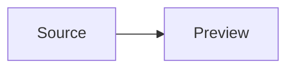

# Markdown Preview

Open a live native preview with `:markdown preview` or `:mdpreview`; use `:markdown refresh` and `:markdown close` to control it. The preview shares the source buffer and re-renders after edits.

## Syntax

Shed renders CommonMark plus GFM tables, task lists, strikethrough, autolinks, footnotes, heading anchors, and GitHub alerts. Fenced and indented code blocks, nested blockquotes/lists, reference links, local images, and normal Markdown links are included.

Math uses MathJax-compatible delimiters: inline `$...$` or `\\(...\\)`, and display `$$...$$` or `\\[...\\]`. TeX is rasterized locally; it does not load MathJax, fonts, or any other network asset.

Mermaid uses fenced blocks with the `mermaid` info string:

````markdown

````

Diagrams are rasterized locally by the bundled JVM renderer; Node, a browser, a CDN, and `mmdc` are not required.

## Safety and limits

Raw HTML remains escaped. Remote images are replaced with an unavailable-image label and are never fetched. Relative images resolve from the Markdown file's directory; local `file:` image URLs are allowed. External links still require an explicit click.

Mermaid source is capped at 64 KiB per block and rendered images at 4096 px per side. Invalid TeX stays as source text; Mermaid failures show a preview error and preserve the original fence.
