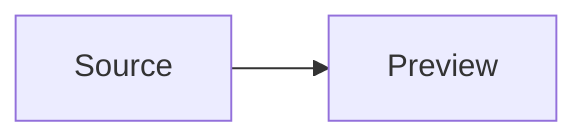

# Markdown Preview

Open a live native preview with `:markdown preview` or `:mdpreview`; use `:markdown refresh` and `:markdown close` to control it. The preview shares the source buffer, re-renders after edits, and follows source scrolling or caret movement by default. If a new preview has not yet received its Swing layout, source synchronization retries through a small bounded layout-settling window; if Swing still reports no range, Shed seeds a temporary line-count-based range until the real HTML layout replaces it. This avoids dropping the first source-scroll event in a newly created or not-yet-shown split. Set `"markdown.preview.scroll.sync" = false` in `~/.shed/config.toml`, or uncheck it in Settings → Markdown Preview, to disable source-to-preview scrolling.

## Syntax

Shed renders CommonMark plus GFM tables, task lists, strikethrough, autolinks, footnotes, heading anchors, and GitHub alerts. Fenced and indented code blocks, nested blockquotes/lists, reference links, local images, HTTPS GitHub attachments, Shields-style SVG badges, and normal Markdown links are included.

Math uses MathJax-compatible delimiters: inline `$...$` or `\\(...\\)`, and display `$$...$$` or `\\[...\\]`. TeX is rasterized locally; it does not load MathJax, fonts, or any other network asset.

Mermaid uses fenced blocks with the `mermaid` info string:

````markdown

````

Diagrams are rasterized locally by the bundled JVM renderer; Node, a browser, a CDN, and `mmdc` are not required.

## Safety and limits

Raw HTML supports a sanitized Swing-compatible subset: `div`, headings, paragraphs, links, images, lists, tables, blockquotes, and text-formatting tags. `script`, `style`, event attributes, forms, embeds, media, and inline SVG are removed; relative images resolve from the Markdown file's directory and local `file:` image URLs are allowed. After the user explicitly opens a normal Markdown preview, Shed may fetch eligible HTTPS images in a bounded background job. They are cached only for that preview session and re-rendered from local PNG files. External links still require an explicit click.

Remote images require `https`, no user-info or non-default port, a non-local host, a successful public-address check, a 12 MiB response limit, and dimensions no larger than 4096 px or 16 megapixels. SVG responses are rejected when active content is present, rendered with scripts and external resources disabled, then converted to PNG. Set `"markdown.preview.remote.images" = false` to keep previews local-only. Notebook Markdown remains local-only.

Mermaid source is capped at 64 KiB per block and rendered images at 4096 px per side. Invalid TeX stays as source text; Mermaid failures show a preview error and preserve the original fence.
