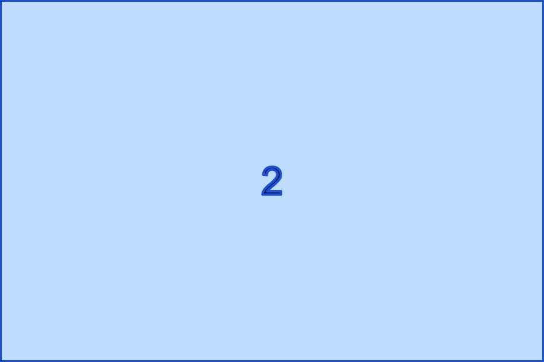
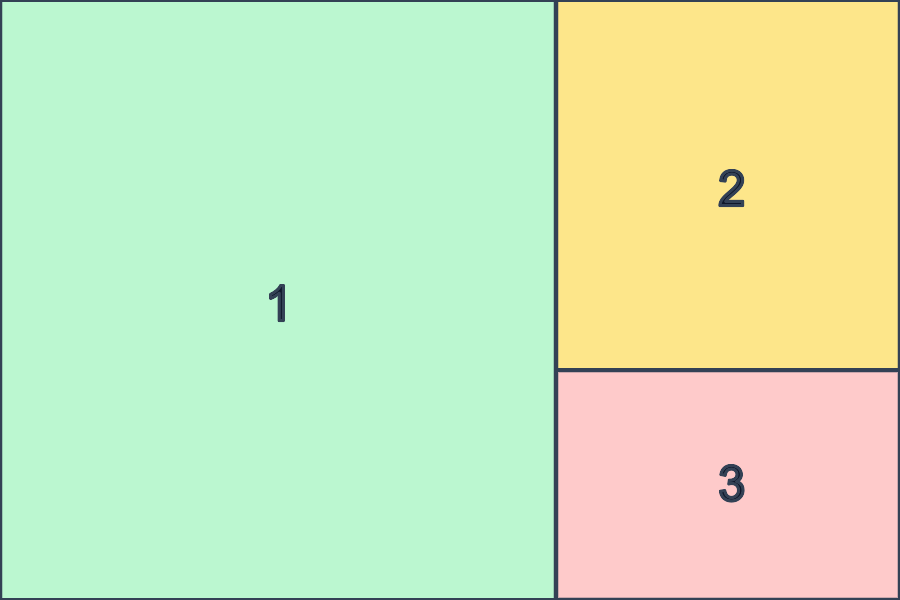
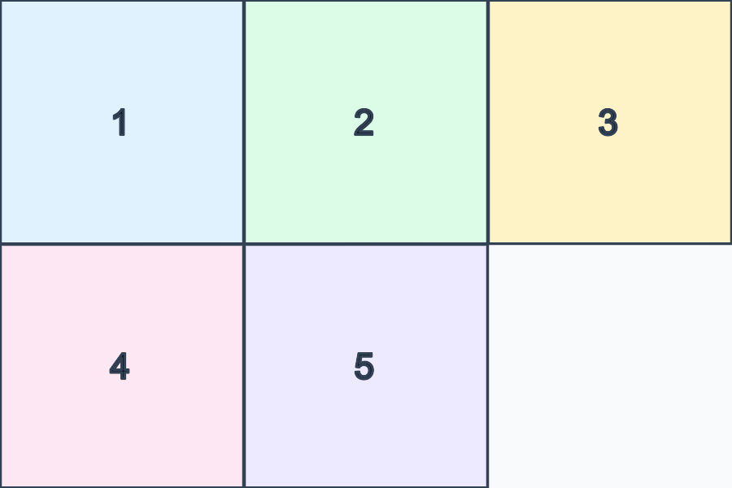
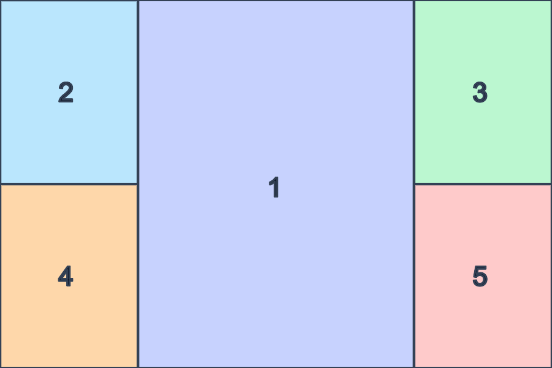
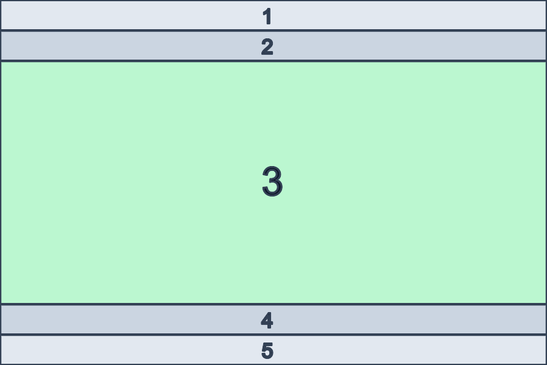

# Layouts Research

Backlog notes for post-v0.1 layout plugins. These are stubs, not commitments to ship in core.

## v0.2 Candidates

### Monocle

Source model: dwm's `monocle(Monitor *m)` counts visible clients, updates the layout symbol, then resizes every tiled client to the monitor work area. This is the cleanest precedent for olly because it is pure placement with focus cycling outside the layout.

olly shape:
- `MonocleLayoutEngine`
- focused tiled window receives `bounds`
- siblings are hidden offscreen with `hidden = true`
- cycle helpers expose next/previous focus IDs

Screenshot:

Source:
- https://git.suckless.org/dwm/file/dwm.c.html

### Spiral / Fibonacci

Source model: XMonad's `XMonad.Layout.Spiral` exposes `spiral` and `spiralWithDir`, with a ratio controlling successive window sizes and configurable starting direction/rotation. awesome also exposes `awful.layout.suit.spiral` and `awful.layout.suit.spiral.dwindle` in its built-in layout list.

olly shape:
- `SpiralLayoutEngine`
- config: `splitRatio`, defaulting to the golden ratio
- pure recursive split of the remaining rect
- alternates split sides while choosing the longer remaining axis
- no hidden windows

Screenshot:

Source:
- https://xmonad.github.io/xmonad-docs/xmonad-contrib/XMonad-Layout-Spiral.html
- https://awesomewm.org/apidoc/libraries/awful.layout.html

### Grid

Source model: Qtile `Matrix` divides the screen into equal cells with configurable columns. awesome's `fair` layout also targets roughly equal client sizes.

olly shape:
- `GridLayoutEngine`
- config: `policy = squareish | fixedCols(Int) | fixedRows(Int)`
- deterministic row-major placement
- windows are sorted by AX window ID before placement
- last row may have empty cells; do not resize earlier rows based on tail count

Screenshot:

Source:
- https://docs.qtile.org/en/latest/manual/ref/layouts.html
- https://awesomewm.org/apidoc/libraries/awful.layout.html

### ThreeCol / CenteredMaster

Source model: XMonad `ThreeCol` is Tall-like but with three columns. `ThreeColMid` places the main window between stack columns; both stack columns use the same size when both are visible.

olly shape:
- `ThreeColLayoutEngine`
- config: `masterRatio`
- centered master uses left/right stacks with balanced window counts
- ultrawide-first defaults, not a MasterStack replacement

Screenshot:

Source:
- https://xmonad.github.io/xmonad-docs/xmonad-contrib/XMonad-Layout-ThreeColumns.html

### Accordion

Source model: XMonad exposes decorated layouts based on `Accordion`. Its practical UI is vertical ribbons where only one region is expanded and siblings remain visible through title/decor strips.

olly shape:
- `AccordionLayoutEngine`
- config: `stripHeight`
- focused window gets expanded rect
- non-focused windows keep small top/bottom strips
- strip height clamps when needed to keep the expanded region visible

Screenshot:

Source:
- https://xmonad.github.io/xmonad-docs/xmonad-contrib/XMonad-Layout-DecorationMadness.html

## v0.3+ Research Hooks

### Tabbed / Stacked Bar UX

Tabbed and Stacked layouts need a visible selector because multiple windows share one logical tile. The layout engine should stay pure and emit placement plus tab/stack metadata; rendering belongs in `ollyApp`.

AX-only rendering:
- Uses the target windows' own frames, titles, focus, and raise actions.
- Keeps olly out of the drawing path and avoids overlay z-order bugs.
- Cannot draw real tab strips or stack rails on another app's window chrome.
- Offers no reliable pointer hit targets for selecting hidden siblings.
- Works as a keyboard-only fallback when overlay windows are disabled.

Overlay `NSWindow` rendering:
- Uses olly-owned borderless panels positioned above the tile or along the stack rail.
- Can draw selected state, titles, icons, hover, drag targets, and click-to-focus.
- Must track display changes, safe zones, active tags, window moves, and Space visibility.
- Must not become an app switcher target, steal key focus during normal tiling, or cover notch/menu-bar reserves.
- Needs explicit accessibility labels and keyboard equivalents so tabs are not pointer-only.

Decision for implementation:
- Keep `TabbedLayoutEngine` and `StackedLayoutEngine` pure.
- Add a separate `TabBarOverlayController` in `ollyApp` fed by engine metadata.
- Treat AX-only mode as keyboard fallback, not as the primary tab/stack UI.
- Do not model overlays as child windows of foreign app windows; olly owns them and repositions them from snapshots.

### Frame Tree

Source model: herbstluftwm starts with one frame; frames can contain windows or split into two frames. This maps to an olly plugin host that can nest layout engines inside frame leaves.

Source:
- https://herbstluftwm.org/tutorial.html
- https://man.archlinux.org/man/herbstluftwm.1

### Multi-Tag Union

Source model: river supports tags instead of fixed workspaces; a window can have multiple tags and multiple tags can be displayed at once. olly already stores tags as a bitset, so the layout input can be the active union without changing the engine protocol.

Source:
- https://github.com/riverwm/river
- https://isaacfreund.com/blog/river-intro/

### Pinned Columns

Source model: hyprscroller exposes `scroller:pin` for pinning a column in a scrolling layout. Niri and PaperWM establish the scrollable column model: columns live on an infinite horizontal strip and focus/navigation scrolls the visible viewport.

olly shape:
- `PinnedColumnsLayoutEngine<Base>`
- wraps a scrollable base engine instead of extending `LayoutEngine`
- detects columns from shared placement x-position and width
- moves configured pinned columns to a fixed viewport edge
- raises pinned placements above the scrolling strip so overlap remains visible

Source:
- https://github.com/dawsers/hyprscroller
- https://github.com/niri-wm/niri
- https://github.com/paperwm/PaperWM

## Implementation Gate

For any candidate above:
- add focused unit tests for geometry edge cases
- add a golden fixture under `Tests/ollyLayoutsTests/Fixtures/LayoutSnapshots/`
- emit typed `EngineEvent`s for user-visible state changes
- keep `LayoutEngine.arrange()` synchronous and pure
- no private macOS APIs
